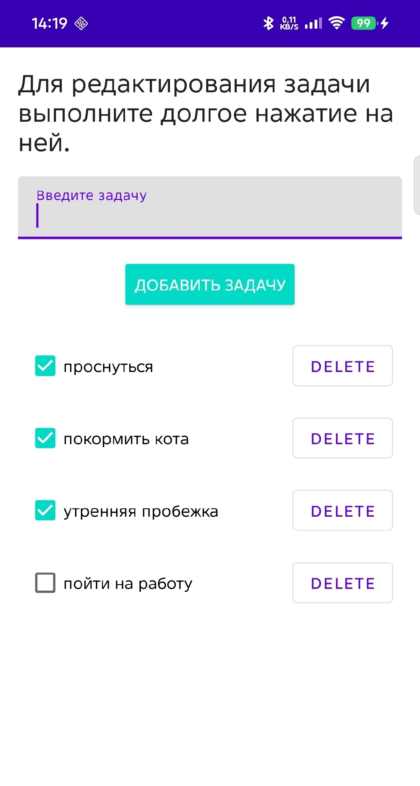
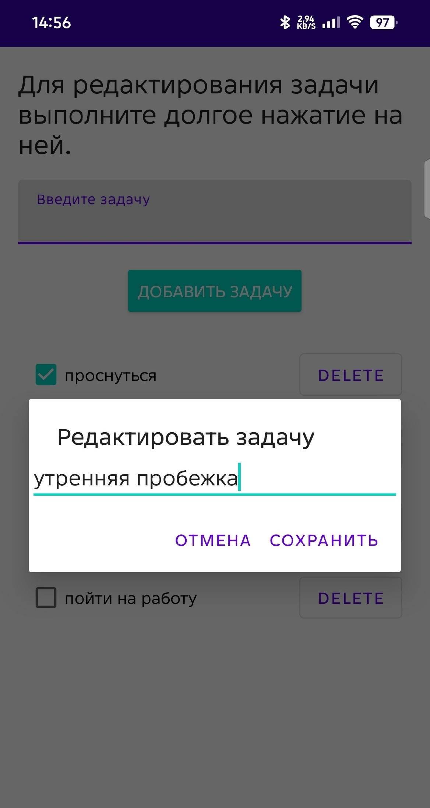
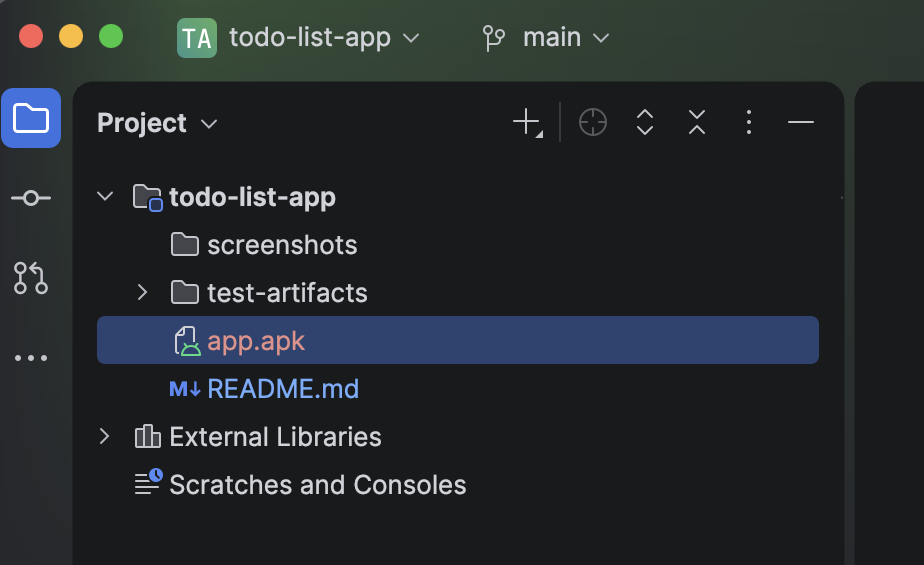
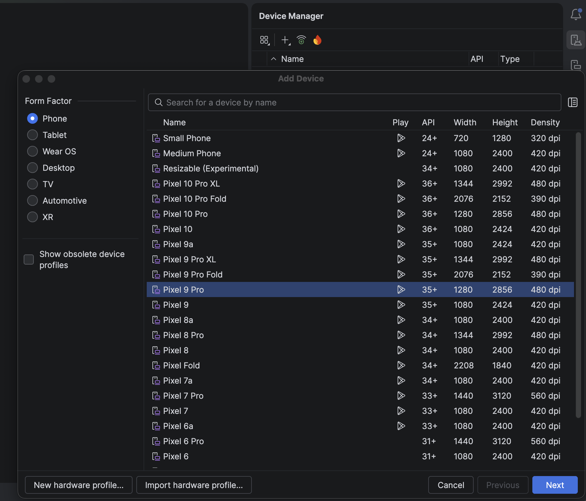
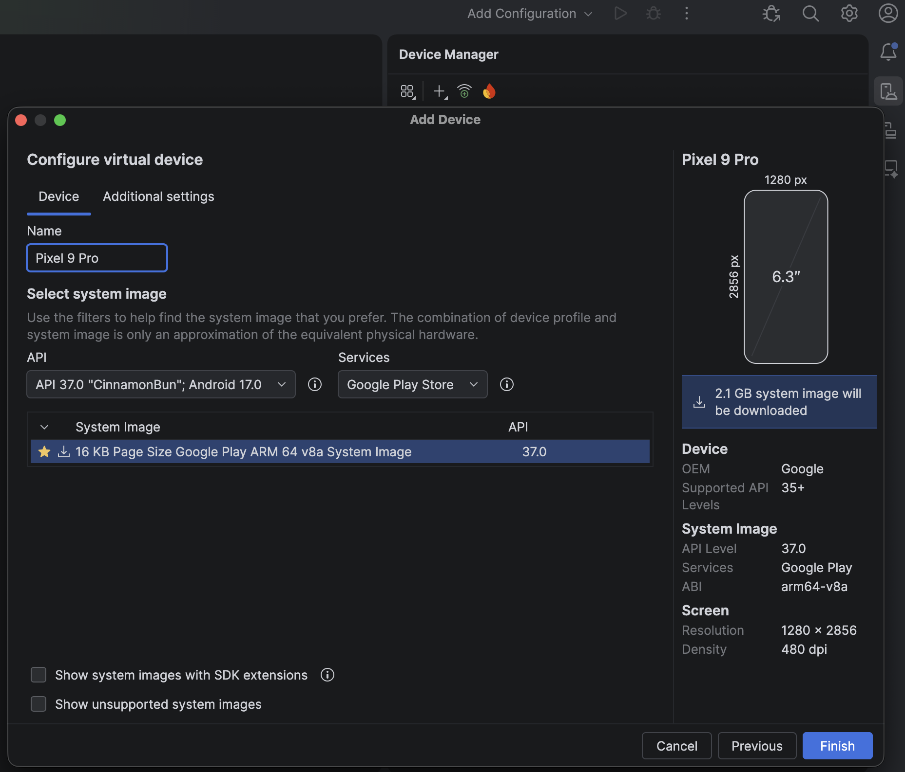
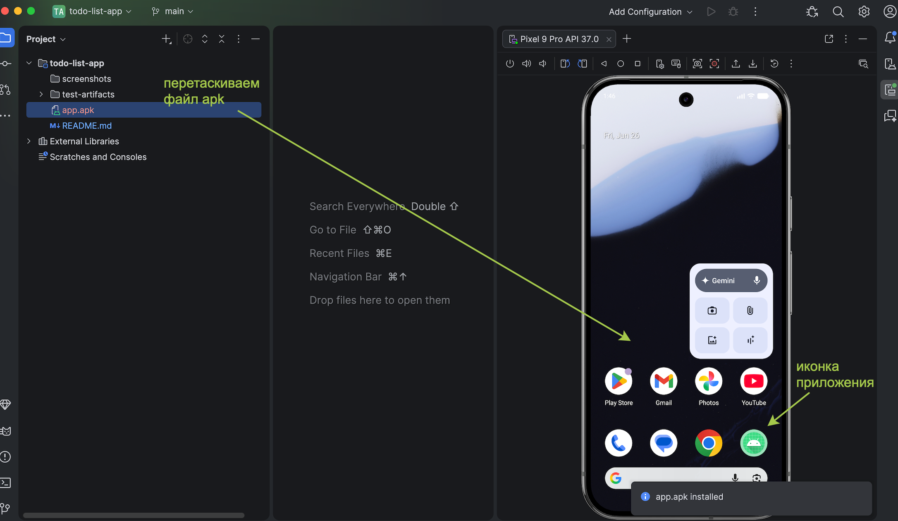
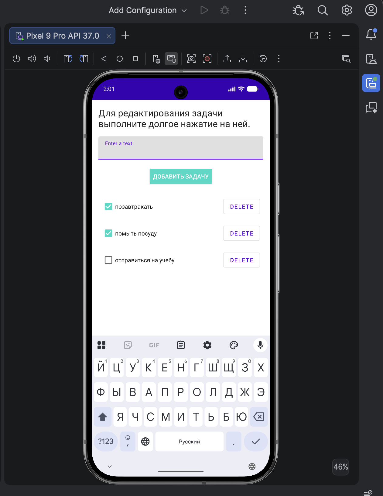

# Тестирование мобильного приложения Todo List

> Проект выполнен в рамках курса "Функциональное тестирование ПО"  
> **Цель проекта** – протестировать небольшое мобильное приложение, составить базовую тестовую документацию и оформить её, потренироваться работать с эмулятором в Android Studio  

---

## 📱 Описание приложения

<table>
  <tr>
    <td width="250">
      
    </td>
    <td width="250">
      
    </td>
    <td style="vertical-align: top;">
      <p><strong>Todo List</strong> — это простое приложение для ведения списка задач на Android</p> 
      <p>Позволяет добавлять, редактировать, удалять задачи и отмечать их как выполненные</p>
      <p><strong>Основные экраны / функциональность</strong></p>
      <p>Экран списка задач:
      <ul style="margin-top: 0; padding-left: 20px;">
        <li>Поле ввода</li>
        <li>Кнопка добавления задач</li>
        <li>Список задач с чекбоксами</li>
        <li>Кнопки удаления задач</li></ul></p>
    <p>Редактирование задач (долгое нажатие):
      <ul style="margin-top: 0; padding-left: 20px;">
        <li>Поп-ап с полем ввода</li>
        <li>Кнопка сохранения изменений</li>
        <li>Кнопка отмены изменений</li>
      </ul>
    </td>
  </tr>
</table>

---

## 🛠 Инструменты тестирования

|    |    |
|-----------|-------------|
| Тестирование | Ручное, исследовательское, функциональное |
| Среда разработки | Android Studio |
| Документация | TestIT, GitHub |
| Управление тестами | Чек-лист, тест-кейсы |
| Отслеживание багов | Баг-репорты |

---

## 🚀 Инструкция по запуску 

### 1. Установить Android Studio
Скачать и установить [Android Studio](https://developer.android.com/studio) с официального сайта

### 2. Склонировать репозиторий проекта
Открыть терминал, перейти в нужную директорию для сохранения проекта и выполнить:
```bash
git clone git@github.com:softpaw-mango-cat/todo-list-app.git
```

### 3. Запустить эмулятор в Android Studio
- Открыть проект в Android Studio  
  
  

- Найти Device Manager и создать устройство для эмуляции (например, Pixel 9 Pro)
  
  


- Выбрать конфигурацию устройства (или использовать рекомендуемую) и подождать загрузки необходимых компонентов
  
  


- Запускаем выбранное устройство в Device Manager, перетаскиваем app.apk из папки проекта на устройство

  

- Нажимаем на иконку приложения на эмулированном телефоне, чтобы запустить его. Приложение можно тестировать 🔥
  
  

- *Опционально - приложение можно также запустить на своём физическом устройстве (телефоне на Android) или добавить его в Android Studio, чтобы тестировать через интерфейс Studio.*


## ✅ Результаты тестирования 

Чтобы протестировать основную функциональность приложения, был написан чек-лист необходимых проверок, и затем разработаны тест-кейсы:
- [Чеклист](test-artifacts/Чек-лист.md) 
- [Тест-кейсы](test-artifacts/Тест-кейсы_Приложение.pdf)  
   *тест-кейсы можно также посмотреть [в этом проекте](ссылка) в TestIT*

По результатам прохождения тест-кейсов было найдено несколько багов, задокументированных здесь:
- [Баг-репорты](test-artifacts/Баг-репорты_Приложение.pdf) 